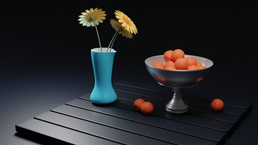
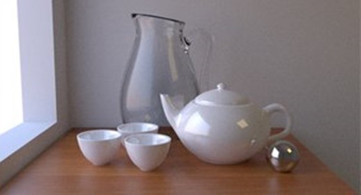
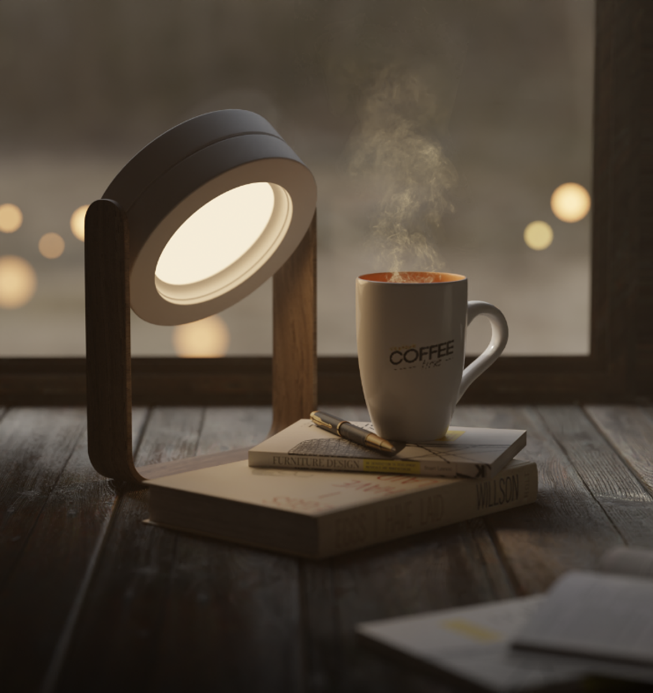

# Art Task

Create a still life scene using 5-6 objects. The objects need to be your own creation. Your objects will reflect your interests, so choose them to represent a specific concept you will try to communicate. Do not use same objects. “Color” the scene using textures and materials for all the objects. Use editor to adjust the view of your scene. Render the final scene as an image.

The scene can be as simple or complex as you want. You will be judged on your originality, coherence of the scene, and compositing skills.

A few tips:

- Pay special attention to lighting and shadows as they can make or break your scene.
- Do not spend a lot of time trying to make detailed materials and textures. You would be surprised how a simple principled BDSF can make varied materials.
- Explore various camera settings (Macro lens? Depth of field? Motion blur?)
- Keep saving your blend files to avoid losing hours of hard work.
- Do not attempt this in one sitting. Take a break. Come back. I am sure you’ll find things to improve and corrections to make.

Submission would be your `.blend file` + a `decent quality render` of the scene.
Brownie points for using transparency, reflections, mirrors, and other effects.

### Inspirations

### Surprise Us! 😎
