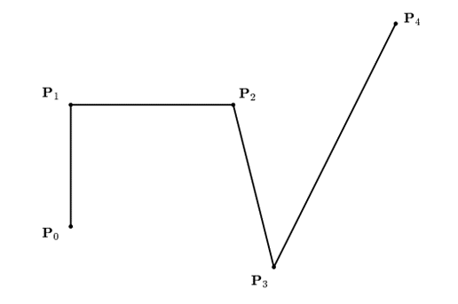
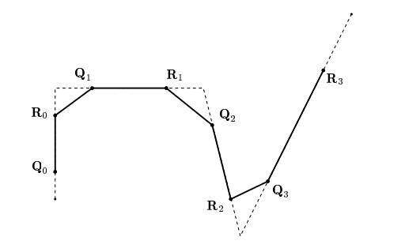
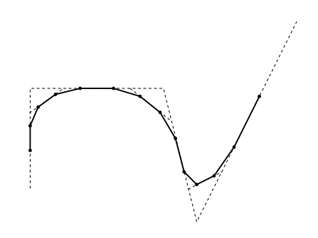
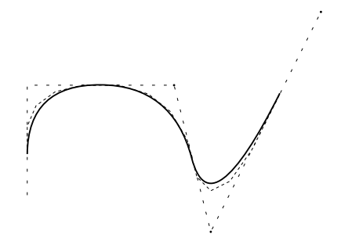
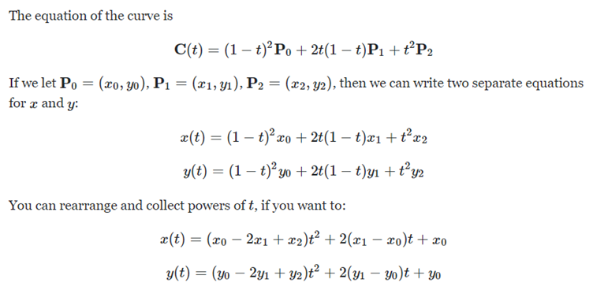

# Computer Graphics Tasks

## Part I

Computer graphics deals with generating images with the aid of computers. It’s amazing the kinds of things we can generate with the advances in this field today. Everything starts with the basics, however. One of the surprisingly hard problems, in the nascent stages of CG development, was to be able to efficiently draw a smooth curve given a limited number of points.

Chaikin came up with an equally surprising solution to this problem in 1974, with his corner cutting algorithms. It is described as follows :

Consider the following points using which you are to form a smooth curve.

Chaikin’s algorithm generates the points `Qi` and `Ri` and uses these points to refine the curve and obtain the control polygon shown in the figure below.

These points are in turn utilized to generate a new refinement,

Subsequently generating a seemingly smooth curve,

You are to code up this algorithm in your favourite programming language ( if you thought of C then I am very concerned :) ).

Find attached a `data.csv` file containing a set of points in cartesian coordinates. Use them to plot first a polygon by simply connecting the points in the given order. Then iteratively apply the Chaikin’s algorithm to generate successively smoother curves.

**_Submission_** format would be your code and 10 png files, numbered 1-10, showing 10 iterations on the given set of points. Ideally what I am looking for is something like this, except for the submission to be png. For more details about the algorithm, you can refer to the following:

- CHAIKIN, G. An algorithm for high-speed curve generation. Computer Graphics and Image Processing, 3 (1974), 346–349.

- RIESENFELD, R. On Chaikin’s algorithm. IEEE Computer Graphics and Applications 4, 3 (1975), 304–310.

PS : Brownie points for coding this up in JavaScript, making it interactive with sliders for number of iterations and an option for showing/hiding the original polygon. (Possibly movable points?)

## Part II

It turns out, what Chaikins was really doing (unknowingly), was simply chaining together a bunch of parabolas (or a quadratic Bezier curve) to generate the shape. Luckily a quadratic Bezier curve can be parametrically defined using three control points.

Consider 3 points P0, P1 and P2.

Now, if you are given a bunch of points, all you need to do is find mid points of all line segments formed and form sets of 2 mid points sandwiching 1 original point and find the Bezier curve between them. (Note that this method would leave out 1st and last point, but that is fine)

Use the same data as Part I to code up a program that uses this method.

Compare this method with the method in Part I. Which one do you find simpler? Which one is computationally harder? Write what you think in about 100 words.

**_Submission_** format would be your code and 1 png file, showing the final curve you obtained, and a `reasoning.txt` file for your reasoning.

### Surprise Us! 😎
